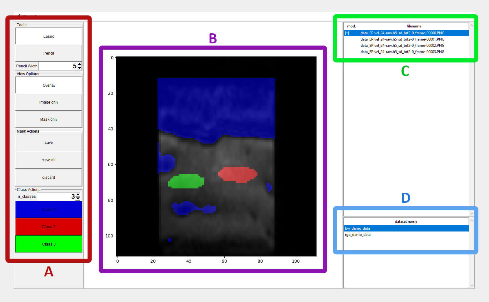
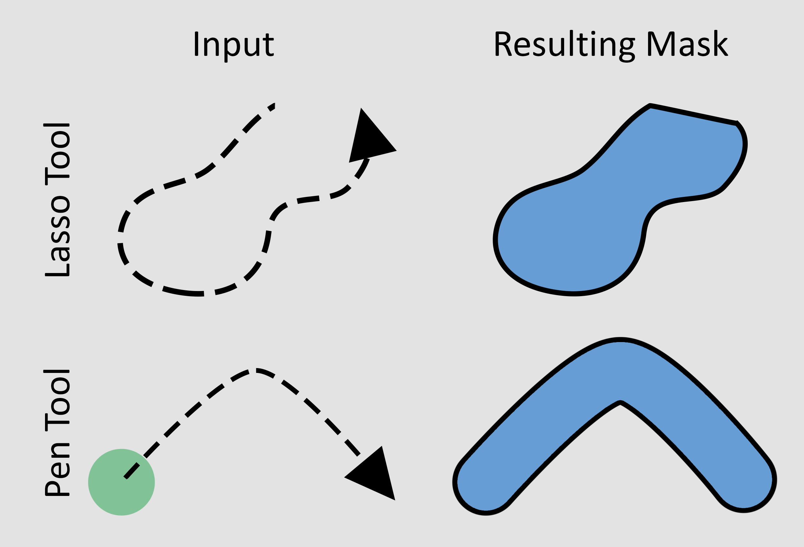

# Summary

SimpleSeg is a GUI application developed in Python for manual multiclass image segmentation. It is made for you, if you seek a simple and user-friendly solution to quickly review or edit your image segmentation masks locally on your machine. The manual segmentation of image data is a tedious task commonly faced in academia, science and other fields. Ultimately, these masks are generated automatically by state-of-the-art neural networks to extract various pieces of information from image data. However, such training requires a representative and diverse dataset of presumably manually segmented images for the specific segmentation task at hand. SimpleSeg provides an efficient workflow to address this challenge in the simplest manner possible.

# Statement of need

Machine Learning has become the de facto standard for a wide array of image-related tasks, particularly in the domain of image segmentation [@seo:20; @minaee:21]. To train or fine-tune such a neural network, a dataset containing accurately segmented image data is essential. Manual segmentation, although tedious, remains a common method for creating this necessary data. A variety of software tools are available for manual image segmentation, yet there is a notable lack of simple and efficient solutions that cover only the essential use cases, with a focus on ease of setup and integration.

On one hand, there is conventional image editing software such as GIMP [@gimp]. These tools indeed offer various methods for creating segmentation masks, however, they lack an efficient workflow for loading, visualizing and saving segmented masks. Images and masks must be opened separately, overlaid manually, and then exported with the correct filename. Thus, creating a sufficiently large dataset manually takes much longer than necessary. With a convenient and efficient workflow in mind, these tools are not the best option.

On the other hand, many great tools have been introduced specifically to address the task of segmenting image data. Examples of popular choices include ImageJ [@imagej] and PaddleSeg [@paddleseg]. However, while these tools are sophisticated and feature-rich, they come with a heavy footprint and are laborious to install. Furthermore, there are requirements regarding the data format, so data conversion might be necessary prior to use. If the user does not want to adopt the required data format, they must reconvert the data back to the original format after using the software.

Other tools do not require installation, as they run online and are accessed through a web browser enabling a quick start [@medseg2020, @labelbox2024]. However, the aforementioned constraints regarding the data format are also present here. Additionally, data must be uploaded to the service, which can be a lengthy task depending on the data size. To obtain the changes locally, data must be downloaded in the end, adding another step to the process.

SimpleSeg addresses these issues by providing a lightweight and easy-to-install solution for manual image segmentation in the form of a Python script. Any potentially required data conversion can be easily implemented directly in Python. These conversions would be performed on the fly during data reads or writes, allowing user data to remain in any given format. SimpleSeg aims to be a solution to a general problem but was specifically initiated to improve work with MRI-acquired image data of fluidized beds, as seen in [@rennebaum:24; @penn:20; @penn:19].

## Features

The main features of SimpleSeg are as follows

- Easy installation and setup
- KISS (Keep it simple, stupid!)
- Manipulation of 2D segmentation masks with up to 10 classes (A)
- Multiple mask view modes (B)
- Quickly load any frame from the dataset (C)
- Quickly switch between datasets (D)
- Supports monochrome and colored (RGB) images.

The installation and configuration process for SimpleSeg is comprehensively outlined in the GitHub repository's README.md document. This flexibility extends to data management, where a bespoke class facilitates the accommodation of data in various structures and formats. Whether the data is distributed among numerous image files, consolidated within a single HDF5 container, or organized in a database, SimpleSeg's architecture supports a wide array of storage solutions. Additionally, for the manipulation of masks, SimpleSeg presently incorporates two distinct tools: Lasso and Pencil. The application and functionality of these tools are depicted in the accompanying illustration.

The easy steps of installation and setup for SimpleSeg are outlined in the GitHub `README.md`. Since data loading and storing is implemented via a custom class, your data can have any shape or form behind the scenes. Storing your data across many image files, in a single HDF5 container or in a database - these are just a few of many options. For mask manipulation, currently the tools called `Lasso` and `Pencil` are implemented. The application and functionality of these tools are depicted in the accompanying illustration.

{ width=50% }

SimpleSeg only uses Python and the packages MatplotLib, Numpy and scikit-image [@python; @matplotlib; @numpy; @scikit-image] and thus runs with minimal dependencies, which are usually included in common Python distributions such as Anaconda.

# Acknowledgements

This project is funded by the Deutsche Forschungsgemeinschaft (DFG, German Research Foundation) – SFB 1615 – 503850735.

# References
